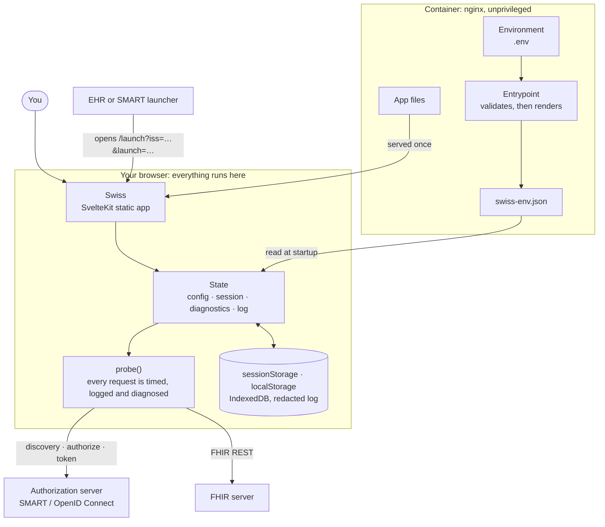
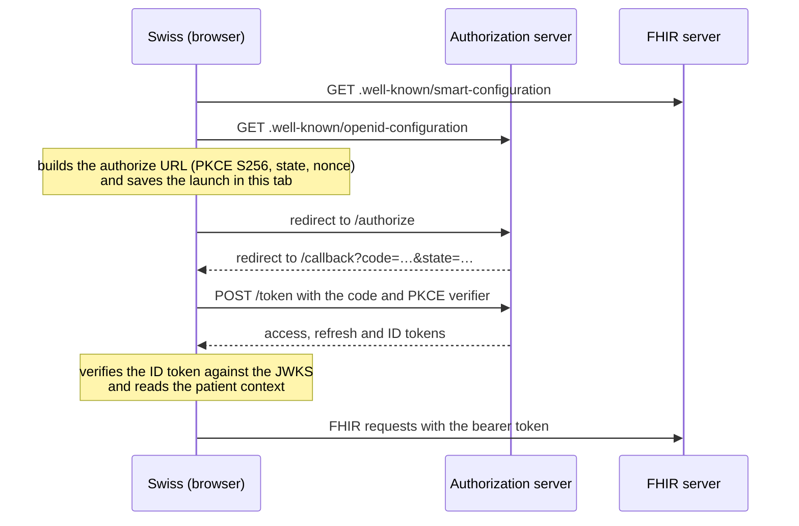

<!--
 Copyright 2021 Omar Hoblos

 Licensed under the Apache License, Version 2.0 (the "License");
 you may not use this file except in compliance with the License.
 You may obtain a copy of the License at

     http://www.apache.org/licenses/LICENSE-2.0

 Unless required by applicable law or agreed to in writing, software
 distributed under the License is distributed on an "AS IS" BASIS,
 WITHOUT WARRANTIES OR CONDITIONS OF ANY KIND, either express or implied.
 See the License for the specific language governing permissions and
 limitations under the License.
-->

# Swiss On FHIR

[](https://github.com/omarhoblos/swiss-on-fhir/actions/workflows/ci.yml) [](https://github.com/omarhoblos/swiss-on-fhir/actions/workflows/release.yml) [](https://github.com/omarhoblos/swiss-on-fhir/actions/workflows/codeql-analysis.yml)

A tool for developers and implementers to test their FHIR and OIDC servers: what tokens come back, and whether permissions are actually enforced when fetching data.

Swiss shows you the raw handshake. Every request it makes is recorded with its response, and when something fails it tries to tell you *why* rather than leaving you with a browser's opaque "Failed to fetch".

## Functionality

The application provides 5 screens, which provide the most commonly needed views for testing auth & token setups:

| Screen | What it is for |
| --- | --- |
| **Config** | The OIDC and FHIR settings. Loaded from `.env` at startup, and editable live in the browser without a rebuild or restart. |
| **Diagnostics** | Runs ~27 checks against your configuration and reports what works, what does not, and what cannot be checked from a browser at all. **Needs no login** — most misconfigurations are visible before a launch is attempted. |
| **Launch** | Starts a SMART flow: standalone, EHR launch, or backend services. Shows the exact authorization URL before sending it. |
| **Session** | Inspects the current session: decoded tokens, launch context with provenance per field, a live expiry countdown, and a granted-vs-requested scope diff. |
| **FHIR API** | A REST console for the FHIR server, with the tokens from the launch. |

## How it works

Swiss runs entirely in your browser. The container only serves the app and renders `swiss-env.json` from its environment at startup; tokens are requested, stored and used in the browser, and never pass through it.



Every request goes through one instrumented path, `probe()`, which times it, records it in the exchange log, and diagnoses a failure instead of leaving you with a bare "Failed to fetch". A launch follows the SMART App Launch sequence, and each step below appears in that log:



## Quick start

### Docker (pre-built image)

```bash
curl -O https://raw.githubusercontent.com/omarhoblos/swiss-on-fhir/main/.env.example
mv .env.example .env
# edit .env to point at your servers
docker run -d -p 127.0.0.1:4200:8080 --env-file .env --name swiss_app omarhoblos/swiss-on-fhir
```

Then open <http://localhost:4200> and register `http://localhost:4200/callback` as a redirect URI with your OAuth client.

Images are multi-arch (`linux/amd64` and `linux/arm64`), so they run on x86 and Apple Silicon.

To confirm your `.env` actually reached the app:

```bash
curl -s http://localhost:4200/swiss-env.json
```

### Docker (from source)

[`compose.yaml`](compose.yaml) builds the image from your checkout and runs it on <http://localhost:4200>, reading your `.env` at startup:

```bash
cp .env.example .env   # then edit it to point at your servers
docker compose up -d --build
```

Stop it, and remove the container and the locally built image:

```bash
docker compose down --rmi local
```

Changing `.env` needs the container recreated, since the configuration is rendered at startup. Running `docker compose up -d` again does that on its own. Or edit the values live in the app, which needs no restart at all.

If port 4200 is taken, choose another with `SWISS_PORT=8080 docker compose up -d --build`, and register `http://localhost:8080/callback` as the redirect URI instead.

The container listens on loopback only (`127.0.0.1`) by default: Swiss is plain HTTP, `/swiss-env.json` may hold a client secret, and PKCE only works from `localhost` in any case. To publish it on every interface, for a reverse proxy on another host, set `SWISS_BIND=0.0.0.0`. The image runs nginx as an unprivileged user on port 8080, which is why the port mappings above end in `:8080`.

### DigitalOcean App Platform

[`.do/app.yaml`](.do/app.yaml) runs the published image from Docker Hub on App Platform, which puts it behind HTTPS on a `*.ondigitalocean.app` address (and a custom domain, if you add one). HTTPS is required: PKCE needs a secure context, so Swiss cannot sign in over plain HTTP on a public address. The spec uses the smallest plan and follows the `3` tag, so every 3.x release is picked up on the next deployment.

Create the app once with [`doctl`](https://docs.digitalocean.com/reference/doctl/), or paste the spec into the control panel:

```bash
doctl apps create --spec .do/app.yaml
```

Its defaults point at the public [SMART App Launcher](https://launch.smarthealthit.org) sandbox, so the app works for anyone who opens it, and each visitor can point it elsewhere on the Config screen. To change the defaults for everyone, edit them under **Settings → swiss → Environment Variables**. They are the same keys as `.env`, taken literally, so leave the values unquoted. Leave `CLIENT_SECRET` out: `/swiss-env.json` is readable by anyone who visits. Register `https://<your-app>/callback` as the redirect URI with each authorization server, and allow that origin for CORS on its token endpoint.

App Platform cannot watch Docker Hub for new images, so the release workflow asks for a deployment after it pushes one. To turn that on, add a repository **variable** `DO_APP_ID` (from `doctl apps list`) and a repository **secret** `DIGITALOCEAN_ACCESS_TOKEN` (a DigitalOcean API token that can update apps). Until then the step is skipped, and **Deploy** in the control panel does the same thing by hand. Do not re-apply the spec to a running app with `doctl apps update`: it would reset any environment variables edited in the control panel.

The app is public, and anyone with the URL can use it. That exposes nothing of yours, since tokens stay in each visitor's browser and never reach the container, but App Platform has no login of its own; restrict access in front of it if you need to.

### Local development

Requires Node 22 or newer.

```bash
cp .env.example .env
npm install
npm run dev      # http://localhost:4200
```

The dev server runs on port 4200 deliberately, because that is the port existing Swiss client registrations use.

| Script | |
| --- | --- |
| `npm run dev` | Dev server with hot reload |
| `npm run build` | Production build into `build/` |
| `npm run preview` | Serve the production build |
| `npm run check` | Typecheck (`svelte-check`) |
| `npm run lint` | ESLint and Prettier |
| `npm run test:unit` | Vitest unit tests |
| `npm run test:e2e` | Playwright end-to-end tests |

## Client registration

Register a client on your authorization server with:

- **Client ID**: whatever you set as `CLIENT_ID` (`swiss` by default)
- **Authorization flow**: authorization code, with PKCE
- **Redirect URI**: `http://localhost:4200/callback` — the exact string is shown on the Config screen with a copy button
- **Scopes**: the scopes from your `.env`. The default for Swiss is `openid fhirUser offline_access launch launch/patient patient/*.read patient/*.write`. It carries both launch scopes so one registration serves both kinds of launch: Swiss sends `launch/patient` on a standalone launch and `launch` on an EHR launch, never both, and says which on the Launch screen
- **Refresh tokens**: enable the refresh token flow if you want `offline_access` to work

Swiss always uses PKCE with S256, so a **public client is the correct configuration** and needs no secret.

### For an EHR launch

An EHR launch starts in the EHR, so the EHR or launcher also needs Swiss's **launch URL**: `http://localhost:4200/launch`. It opens that address with `iss` and `launch` added. The client needs the `launch` scope, which is a different scope from `launch/patient` and is matched exactly: a client allowed only `launch/patient` is refused with `invalid_scope`. Both are in Swiss's default scopes, and Swiss sends only `launch` on an EHR launch. Selecting "EHR launch" there shows the launch URL and the redirect URI for wherever Swiss is running, each with a copy button.

> **Redirect URI note for Swiss 2.x users.** Version 2 documented `/index.html` but the code actually used the bare origin, so existing registrations exist both ways. Swiss 3 accepts a callback arriving at `/callback`, `/`, `/index.html`, or any path carrying `code`, so an existing registration keeps working.

## Configuration

`.env` supplies the defaults. Everything can also be edited live in the app, which layers on top without changing the file — the Config screen tags each value with where it came from (`default`, `from .env`, or `edited here`) and offers a per-field reset.

| `.env` key | Setting | Description |
| --- | --- | --- |
| `FHIRENDPOINT_URI` | FHIR base URL | The FHIR server to query. Also sent as the SMART `aud` parameter. |
| `ISSUER_URI` | Authorization server | Base URL for `/.well-known/openid-configuration` discovery. |
| `CLIENT_ID` | Client ID | Must match the registered client. |
| `CLIENT_SECRET` | Client secret | Leave **empty**. Only set this for a confidential client on a network you control — see below. |
| `SCOPES` | Requested scopes | Space-delimited. SMART 1.0 (`patient/*.read`) and 2.0 (`patient/*.rs`) are both supported. |
| `FRAME_ANCESTORS` | Framing (Docker only) | Space-separated sites allowed to show Swiss inside a frame, sent as `Content-Security-Policy: frame-ancestors`. Defaults to `self`. Add your EHR's origin to test an EHR launch shown inside the EHR, e.g. `self https://launch.smarthealthit.org`. Write `self` and `none` unquoted. One line, at most 2048 characters. |

A few settings are in-app only, because they are per-experiment rather than per-deployment: client authentication method, the `aud` variant, scope syntax, token storage, and log redaction.

> **`docker run --env-file` is not a shell.** Do not quote values in `.env` — quotes are passed through literally and become part of the value. Swiss strips symmetric quotes defensively and warns, but unquoted is correct.

The same `.env` is read by three different parsers, and they agree only on plain values:

| | `docker run --env-file` | Docker Compose `env_file` | `npm run dev` |
| --- | --- | --- | --- |
| Surrounding quotes | kept, as part of the value | stripped | stripped |
| `$VAR` and `${VAR}` | literal | **expanded**; write `$$` for a literal `$` | literal |
| ` #` after a value | part of the value | starts a comment, unless the value is quoted | part of the value |

So a client secret containing `$` arrives intact under `docker run` and truncated under Compose. If a value has a `$` or a `#` in it, check what reached the app on the Config screen.

### Limits, and when the container refuses to start

Every value is limited to 4096 characters, and the rendered `swiss-env.json` to 64 KiB. A value may not contain a tab, a line break or any other control character.

The container checks this at startup and **refuses to start** rather than run with a value it had to alter. The reason is in `docker logs`, naming the variable and never its value:

```text
swiss: FATAL: CLIENT_ID contains a control character (a tab or line break). Remove it from the env file.
swiss: refusing to start. Fix the env file and recreate the container.
```

The usual cause is a trailing tab, or a value pasted with a line break in it. The same applies to a `FRAME_ANCESTORS` that is not a plain list of origins. Under Docker Compose, `restart: unless-stopped` turns this into a restart loop until `.env` is fixed, so look at the logs if the service never comes up. `npm run dev` fails the same way, with the same message.

### Removed in 3.0

`REDIRECT_URI`, `LOGOUT_URI`, `ENABLE_HTTPS` and `STRICT_DISCOVERY_DOCUMENT_VALIDATION` were read by nothing in 2.x and are gone. **Leaving them in your `.env` is harmless** — Swiss recognises them and notes that they can be deleted.

`SKIP_ISSUER_CHECK` is gone too. It turned off the issuer check in the Angular sign-in library, and Swiss 3 runs its own sign-in flow, which an issuer mismatch does not block. Diagnostics still reports a mismatch, with the fix. It is just as harmless to leave in your `.env`.

- `REDIRECT_URI` → derived as `<origin>/callback` and displayed on the Config screen.
- `LOGOUT_URI` → logout now uses `end_session_endpoint` and `revocation_endpoint` from discovery. If your server advertises neither, Swiss clears its own tokens and tells you the IdP session is still live.
- `ENABLE_HTTPS` → plaintext `http` endpoints are always flagged, so there is nothing to toggle.
- `STRICT_DISCOVERY_DOCUMENT_VALIDATION` → declared removed in 2.0.0 and never reinstated.

### Client secrets

Swiss is a browser app: a client secret in it is readable by anyone who opens devtools, and it is served in plaintext at `/swiss-env.json`. Because PKCE is always used, a public client is both simpler and safer.

If you need to test a confidential client on a secured network, set `CLIENT_SECRET` and pick a client authentication method (HTTP Basic or request body — servers differ, and Swiss auto-selects from what yours advertises). An in-app secret is kept only for the tab unless you explicitly tick "remember on this browser".

## Working with FHIR servers

Swiss aims to be server-agnostic, but some servers need specific settings. Contributions are always welcomed.

- [Smile CDR](fhirserverinstructions/fhirservers-smile.md)

If you don't see yours here, contact me and I'll be glad to work with you & your team on how to provide support!

## Test data

[bundle.md](bundle.md) contains a transaction Bundle you can POST to your FHIR server's base. If you use it, arrange for a patient launch context of `patient-a`, and make sure your server or IdP can map the patient record ID into a claim.

## Logs and captured events

Swiss is a static browser app, so it has no filesystem access and cannot append to a log file. What it does instead:

- **Exchange log.** Every request Swiss makes is recorded with its full request, response, timing and failure diagnosis, in a collapsible drawer at the bottom of every page. This is where the "see the raw attempt" messages point.
- **Survives a reload**, including the OAuth redirect, so the handshake that just failed is still there when you land back. Stored in IndexedDB, capped at 200 entries.
- **Downloadable** as timestamped JSON or Markdown. The Markdown export is a transcript with a `curl` reproduction per request, which is the useful thing to attach to a bug report.

**Only the redacted form is ever written to disk.** Exchanges carry live access and refresh tokens; turning redaction off (under Testing options) affects the on-screen view and manual downloads, never what is persisted. Downloads are redacted by default too, with an explicit opt-in if you need the real values.

The app itself writes nothing to the console. If you need server-side request logs, the container's nginx access and error logs go to stdout/stderr, so `docker logs swiss_app` shows them — but note they only cover requests *to Swiss*. Discovery probes, token exchanges and FHIR calls go from your browser straight to your servers and never touch the Swiss container.

## Notes on running Swiss

**Use `http://localhost`, not `http://<your-lan-ip>`.** PKCE needs `crypto.subtle`, which browsers only expose in a secure context. `http://localhost` and `http://127.0.0.1` qualify; `http://192.168.x.x` does not, and the flow cannot work there. Swiss detects this and says so, but it is worth knowing up front. (Swiss 2.x's README recommended the LAN-IP form.)

**Serve it at the origin root.** Sub-path hosting (`https://host/swiss/`) is not supported: the base path is a build-time constant in SvelteKit, so it cannot be runtime-configured the way everything else here can.

## Changelog

See [CHANGELOG.md](CHANGELOG.md).

## Shoutouts

A big thank you to everyone who's helped with this app, including:

* [Jana Mailvaganam](https://github.com/Jaymn) - Application updates & contributions
* [Aditya Dave](https://github.com/AD1306) - Code review & architecture ideas
* Daniel Bach - Creating & validating test data
* Pechow Zheng - Creating & validating test data
* Steven Li - Testing & architecture ideas
* Taha Attari - Code review
* and the wonderful folk at [Smile CDR](https://www.smilecdr.com/our-team)
