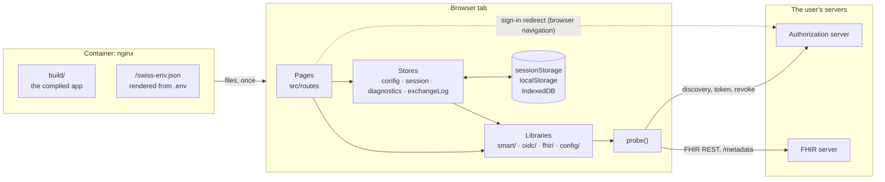
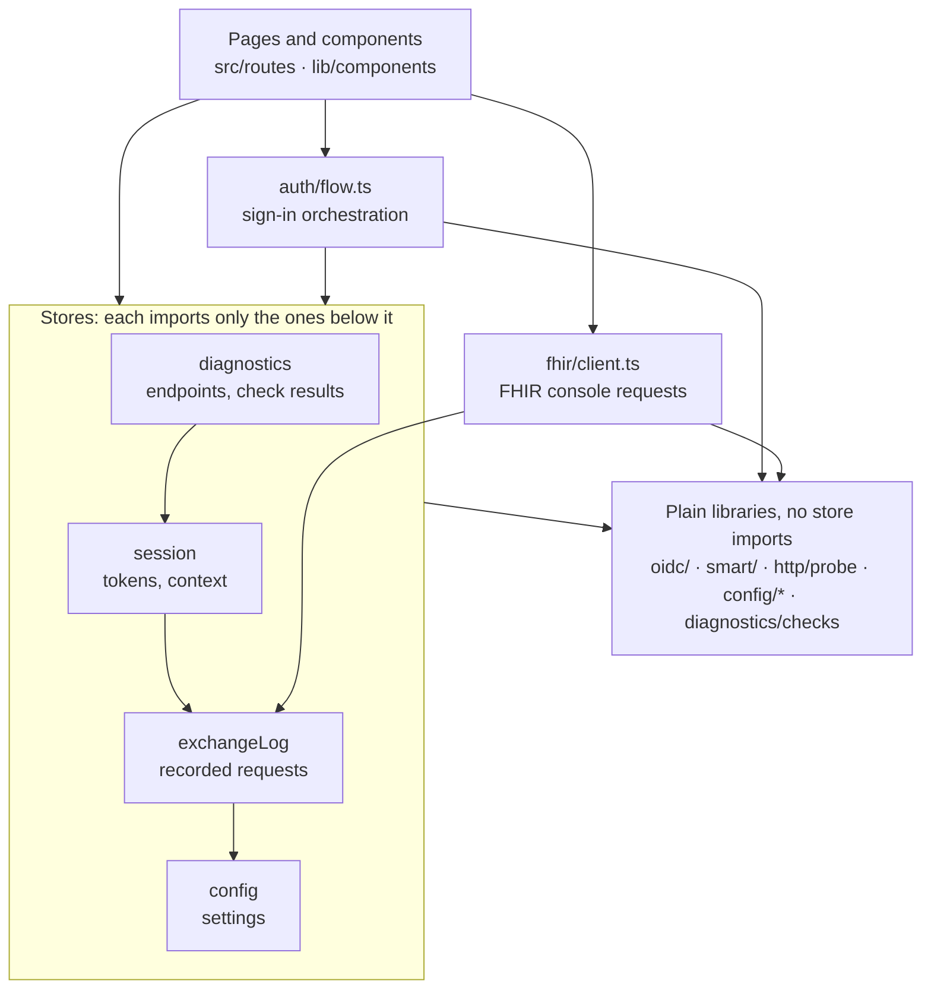
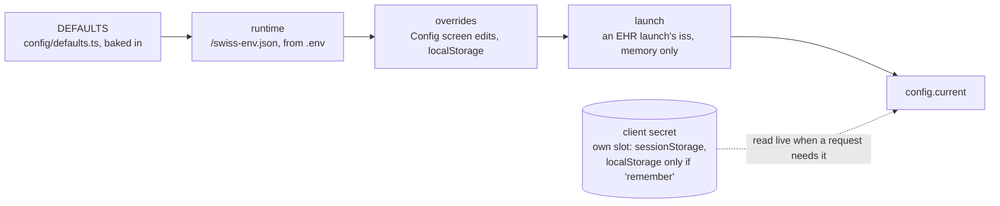
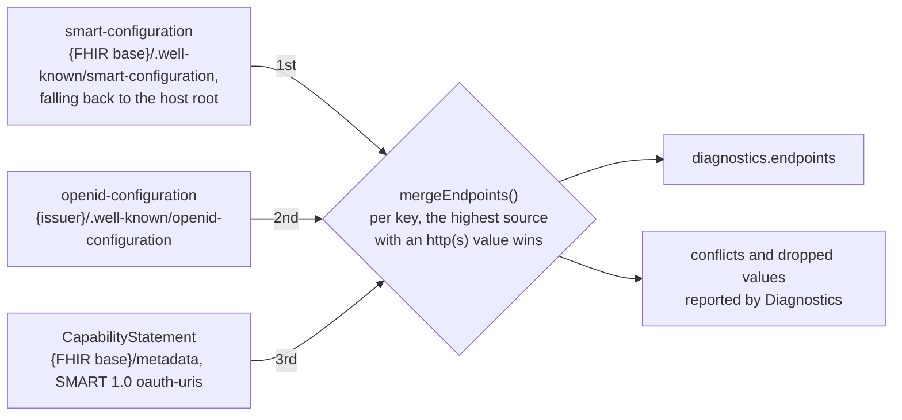
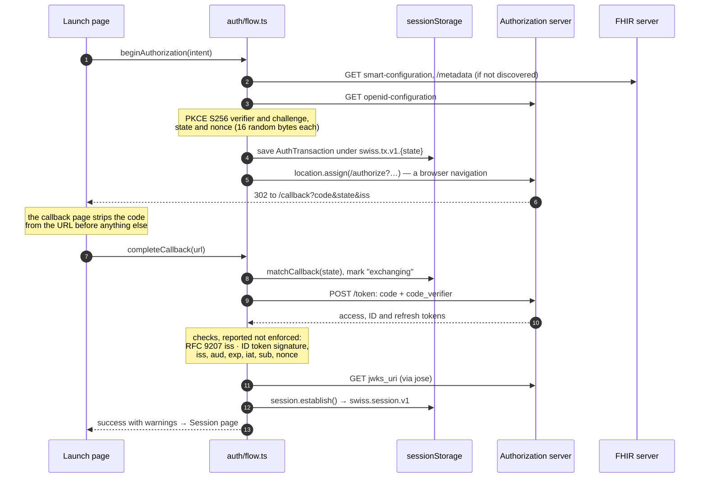
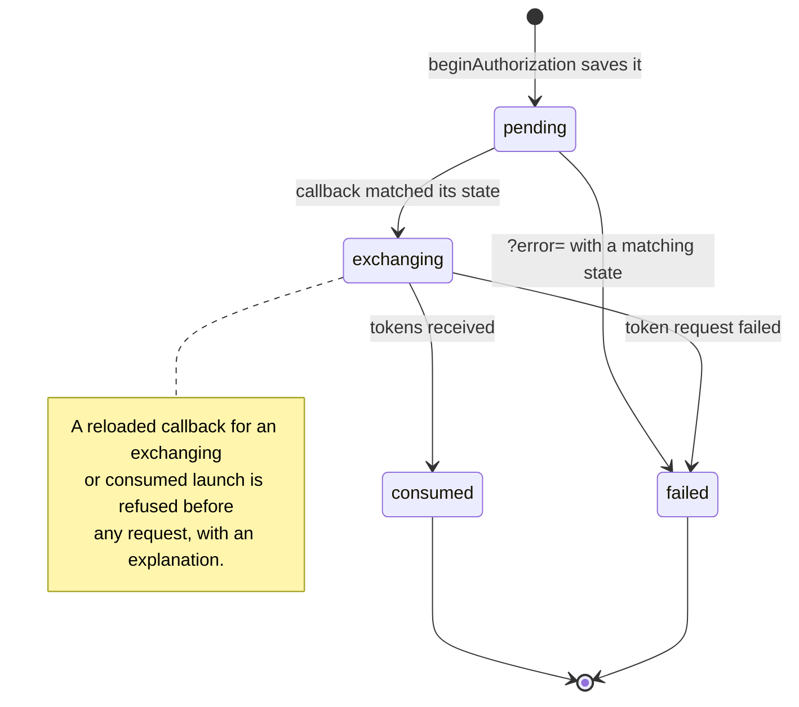
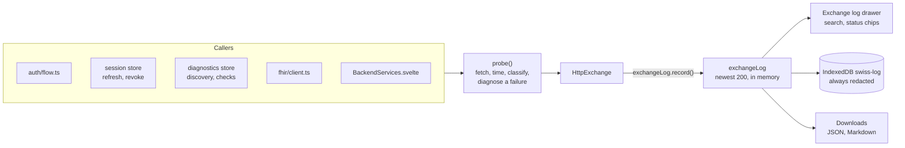
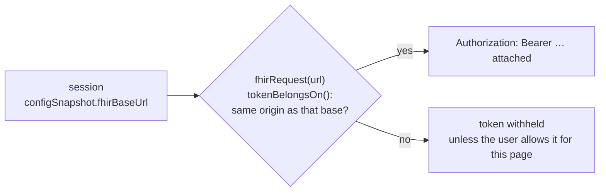
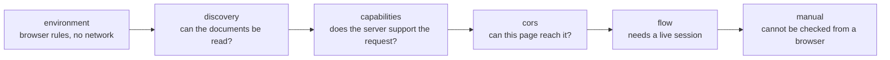
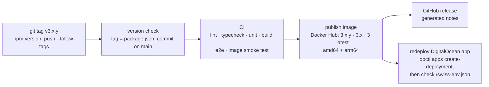

<!--
 Copyright 2021 Omar Hoblos

 Licensed under the Apache License, Version 2.0 (the "License");
 you may not use this file except in compliance with the License.
 You may obtain a copy of the License at

     http://www.apache.org/licenses/LICENSE-2.0

 Unless required by applicable law or agreed to in writing, software
 distributed under the License is distributed on an "AS IS" BASIS,
 WITHOUT WARRANTIES OR CONDITIONS OF ANY KIND, either express or implied.
 See the License for the specific language governing permissions and
 limitations under the License.
-->

# Architecture

How Swiss's parts work together, one mechanism per section. Each section ends with the files to read. Paths are relative to `src/` unless they start with a top-level folder.

The [README](../README.md#how-it-works) has a shorter overview for users. Swiss's own **How Swiss works** page (`/how-it-works`, linked from the footer) draws the same mechanisms for anyone using the app. This page goes one level deeper, for people changing the code.

- [The shape of the app](#the-shape-of-the-app)
- [Who imports whom](#who-imports-whom)
- [Configuration](#configuration)
- [Discovery](#discovery)
- [Signing in](#signing-in)
- [One launch's lifecycle](#one-launchs-lifecycle)
- [After sign-in: the session](#after-sign-in-the-session)
- [Backend services](#backend-services)
- [Every request is logged](#every-request-is-logged)
- [Where the token goes](#where-the-token-goes)
- [Diagnostics](#diagnostics)
- [The container](#the-container)
- [From tag to live](#from-tag-to-live)

## The shape of the app

There is no Swiss backend. The container serves the built app and one generated file, `/swiss-env.json`, when the page loads. From then on everything runs in the browser tab, and requests go from the tab straight to the user's servers.

SvelteKit builds the app with `adapter-static`; `routes/+layout.ts` sets `ssr = false` and `prerender = false`, so nothing is rendered at build time and every route falls back to `index.html` (nginx's `try_files`). The only runtime dependency is `jose`, used for ID token verification and for signing the Backend Services client assertion.

**Read:** `routes/+layout.ts` (loads the runtime config before anything renders), `routes/+layout.svelte` (nav, exchange log drawer, the one clock), `svelte.config.js`.

## Who imports whom

Shared state lives in four stores. Each is a Svelte 5 class whose fields are `$state` and `$derived` runes, exported as a single instance; there is no `svelte/store`. Everything else is a plain module.

Two properties keep this manageable:

- **Libraries do not import stores.** `oidc/`, `smart/`, `http/`, `config/*` (apart from the store itself) and `diagnostics/checks/` are plain functions that take what they need as arguments, including an optional `fetchImpl`. That is what makes them unit-testable in Vitest's Node environment. The one exception is `fhir/client.ts`, which records its own exchanges into the log.
- **`config` depends on nothing.** It sits at the bottom, so any store can read the settings without creating a cycle.

## Configuration

Every page reads one object, `config.current`. It is built per field from four layers, and a higher layer wins.

- **One table drives every setting.** `FIELDS` in `config/fields.ts` has one row per setting: its label, help text, input kind, parser, whether it comes from `.env`, and whether changing it invalidates a session. The Config form and the runtime parser both read it; the README's settings table is kept in step with it by hand.
- **Everything from `/swiss-env.json` is a string**, because it is rendered from environment variables (by `40-swiss-config.sh` in the container, `scripts/render-config.mjs` in development). `config/coerce.ts` turns those strings into URLs, booleans, scopes and enums. It also tells an unsubstituted `${VAR}` placeholder from a real value, and caps every value at `MAX_VALUE_LENGTH`.
- **Validation warns rather than refuses.** `config/validate.ts` reports a suspicious configuration as warnings, because Swiss must load a suspicious configuration in order to diagnose it. Only unusable states, such as a missing client ID, are errors.
- **The launch layer is never saved.** An EHR launch's `iss` is correct for that launch only, so one launch cannot rewrite saved settings. The Launch page owns the layer: it applies it while the URL carries `iss` and clears it when the URL loses it or the page is left.
- **The client secret is kept apart.** It is stored in its own slot (`config/persist.ts`) and is left out of `ConfigSnapshot`, the copy of the settings that each launch and session saves. Requests read it live from the store.

**Read:** `config/config.svelte.ts` (the store and its layers), `config/fields.ts`, `config/runtime.ts`, `config/coerce.ts`, `config/validate.ts`, `config/persist.ts`, `config/merge.ts`, `scripts/render-config.mjs` (renders `.env` for `npm run dev`).

## Discovery

Before a sign-in, Swiss needs the server's endpoints. Up to three documents can provide them, and they often disagree, so Swiss reads all of them and decides per endpoint in a fixed order of trust.

- **The FHIR server outranks the identity provider.** In SMART, the FHIR server is the authority on which authorization server protects it. The order is the `PRECEDENCE` list in `smart/discovery.ts`.
- **Every candidate is kept.** `advertisedValues()` returns every value any document gave for a key, so a caller can retry. The ID token check uses it to try the next `jwks_uri` when the preferred one does not answer.
- **Discovery is explicit, never reactive.** It runs when the Launch page opens and when someone runs Diagnostics. It is skipped while `diagnostics.discovered` matches the configured FHIR base and issuer, and concurrent callers share one in-flight run. Never add an `$effect` that re-discovers on settings changes: it would send requests on every keystroke in the Config editor.
- **An EHR launch is discovered from its own server.** When `iss` names a server other than the configured FHIR base, discovery uses the issuer that server's `smart-configuration` declares and never falls back to the configured issuer. `diagnostics.discoveryStale` tells callers that the held endpoints belong to another base or issuer, and they re-discover before using them.

**Read:** `smart/discovery.ts` (fetching and merging), `diagnostics/diagnostics.svelte.ts` (`discover()`, staleness, the shared run), `smart/capabilities.ts` (turns `smart-configuration` into feature gates).

## Signing in

A sign-in is the authorization code flow with PKCE, built and checked by Swiss itself. `auth/flow.ts` holds both halves: `beginAuthorization` before the redirect and `completeCallback` after it.

- **Everything the callback needs is saved before the redirect.** The `AuthTransaction` holds the PKCE verifier, the redirect URI, the endpoints and a `ConfigSnapshot`, so editing the settings mid-flow cannot cause an inexplicable `invalid_grant`.
- **Checks produce findings, never refusals.** `oidc/iss-parameter.ts` compares the redirect's `iss` with the discovered issuer. It also notices when a server advertises RFC 9207 support and then omits `iss`. `oidc/id-token.ts` verifies the ID token:
  - only asymmetric algorithms are accepted;
  - `sub`, `exp` and `iat` are required;
  - `iss` and `aud` must match;
  - the nonce must match the one sent.

  Failures become warnings on the callback page and a note on the ID token panel. The session is established either way.
- **The URL is built by hand.** `oidc/authorize.ts` builds the authorization URL so the Launch page can preview it exactly. It never puts the client secret on the URL. The `aud` form (exact, with or without a trailing slash, or omitted) is a setting, because servers disagree about it.
- **Scopes depend on the launch type.** `adjustScopesForFlavor` (`smart/scopes.ts`) sends `launch` on an EHR launch and `launch/patient` on a standalone one, never both, and reports what it changed.

**Read:** `auth/flow.ts`, `oidc/pkce.ts`, `oidc/authorize.ts`, `oidc/token.ts`, `oidc/id-token.ts`, `oidc/iss-parameter.ts`, `routes/launch/+page.svelte`, `routes/callback/+page.svelte`. The whole sequence is tested end to end in `e2e/flow.spec.ts`.

## One launch's lifecycle

Each launch is saved in `sessionStorage` under `swiss.tx.v1.<state>` (with a small index of recent states) and moves through four statuses. They exist to stop one mistake: sending a single-use authorization code twice.

- **A transaction older than 10 minutes is still tried**, with a warning: the server's answer is more informative than refusing locally.
- **An unmatched `?error=` is not trusted.** If its `state` matches no launch in this tab, it is shown labelled as not coming from your launch, and nothing is recorded against the session.
- **Storage is untrusted input.** What is read back from storage passes through `isAuthTransaction` (and `isPersistedSession` for sessions) before it is used. Expired transactions are pruned when the app loads.

**Read:** `auth/transaction.ts` (`matchCallback`, statuses, pruning).

## After sign-in: the session

`auth/session.svelte.ts` holds the established session under `swiss.session.v1`. Where it is stored is a setting: `sessionStorage` (the default), `localStorage`, or memory only.

- **Launch context** comes from `smart/context.ts`. It reads `patient` and `encounter` from the token response first, then the ID token, then the access token if it is a JWT, and `fhirUser` from the ID token first. It records each value's source and notes when sources disagree.
- **Scopes** are compared in `smart/scopes.ts`: requested against granted, in SMART 1.0 (`.read`/`.write`) and 2.0 (`.cruds`) syntax. A syntax normalisation is not reported as a reduction.
- **Refresh is manual on purpose.** A silent refresh that succeeds teaches nothing, and one that fails looks like a random logout. A refreshed ID token is checked again, including that its `sub` has not changed.
- **Revoke** calls the revocation endpoint (refresh token first). **Log out** links to `end_session_endpoint` when the server advertises one; otherwise Swiss can only discard its own tokens and says so.

**Read:** `auth/session.svelte.ts`, `auth/storage.ts`, `smart/context.ts`, `smart/scopes.ts`, `routes/+page.svelte` (the Session page), `components/TokenPanel.svelte`, `components/ClaimGlossary.svelte`, `oidc/claims.ts`.

## Backend services

The Launch page's third mode is the `client_credentials` grant with a signed JWT instead of a user. `oidc/keys.ts` generates a non-extractable RS384 or ES384 key pair with Web Crypto. It stores the pair in IndexedDB (`swiss-keys`) and exports the public JWKS for registering with the server. `oidc/assertion.ts` signs the client assertion with `jose` and requests the token; the result becomes a session like any other.

**Read:** `oidc/keys.ts`, `oidc/assertion.ts`, `components/BackendServices.svelte`.

## Every request is logged

Every HTTP request goes through `probe()`. It returns an `HttpExchange`, a record of the request, the response and a classified outcome, and the caller records that into the exchange log.

- **The outcome** is one of `ok`, `http-error`, `network-or-cors`, `timeout`, `invalid-json`, `bad-content-type`, `blocked-precondition` (never sent, because the browser would refuse it) or `aborted`. A failure also carries a `diagnosis`: the likely cause, a confidence and the evidence, such as a CORS block or a page that is not a secure context.
- **Only the redacted form reaches disk.** `http/exchange.ts` masks secrets and tokens, including nested token keys and credential-looking headers. The IndexedDB copy, which lets the log survive the OAuth redirect and a reload, is always redacted, whatever the redaction setting says.
- **Filtering never changes downloads.** The drawer's search and status chips (`http/log-filter.ts`) narrow the view only; downloads contain every entry.

**Read:** `http/probe.ts`, `http/exchange.ts`, `http/log.svelte.ts`, `http/log-persist.ts`, `http/log-filter.ts`, `components/ExchangeLogDrawer.svelte`.

## Where the token goes

The FHIR console attaches the access token only to the server the session was issued for.

- **The token follows the session, not the settings.** `config.current.fhirBaseUrl` can change under a session, through an edit or an EHR launch's `iss`. Never decide where a token goes from it.
- **Typed URLs and paging links are checked too.** An absolute URL typed into the console, or a `Bundle.link[next]` on another host, gets the token only after the user allows it for the current page. The console says when the token was withheld.
- **Writes need an explicit switch** per FHIR base (POST, PUT, PATCH, DELETE).

**Read:** `fhir/client.ts` (`fhirRequest`, `tokenBelongsOn`), `fhir/url.ts` (`buildFhirUrl`, `nextPageUrl`), `fhir/operation-outcome.ts`, `routes/fhir/+page.svelte`.

## Diagnostics

Diagnostics is a list of checks run in a fixed order, so that the report reads as a story. A check that depends on another is skipped, by name, when that one fails.

- **A check is an object** with an `id`, `title`, `group`, optional `dependsOn` and a `run(ctx)` that returns a `result()`. Each group has its own file in `diagnostics/checks/`, and `checks/index.ts` sets the order.
- **The context is deliberately narrow.** `DiagnosticsContext` exposes the config, the discovery documents, the resolved endpoints, the feature gates and a few session facts, not the session object. That keeps each check's dependencies visible and testable.
- **Every result carries its evidence.** Results include the raw `HttpExchange`s, so a reader can verify any finding, and remediation text from `diagnostics/remediation.ts`.
- **Some checks need a click.** A check marked `mutating` changes state on the server, so it only runs when asked.
- **One probe sends a fake code on purpose.** The CORS group sends a fake authorization code to the token endpoint. The answer tells a CORS problem (no readable response) from a client registration problem (`invalid_client`) from a healthy setup (`invalid_grant`).

**Read:** `diagnostics/checks/*.ts`, `diagnostics/runner.ts` (ordering, skips, abort), `diagnostics/types.ts` (`Check`, `result()`), `diagnostics/filter.ts`, `routes/diagnostics/+page.svelte`.

## The container

The image is a two-stage build: Node builds the static app, then `nginxinc/nginx-unprivileged` serves it on port 8080 as a non-root user. The build deliberately bakes in no configuration (`render-config --defaults-only`); CI asserts that.

At startup two entrypoint scripts run:

- `docker/docker-entrypoint.d/40-swiss-config.sh` renders `/swiss-env.json` from the environment.
- `41-swiss-security-headers.sh` renders the security headers, including `Content-Security-Policy: frame-ancestors` from `FRAME_ANCESTORS`.

Both refuse to start on a control character or an over-long value. They print a `swiss: FATAL:` line naming the variable, never the value. `docker/test-entrypoints.sh` feeds them hostile values in CI.

**Read:** `Dockerfile`, `docker/nginx.conf`, `docker/docker-entrypoint.d/`, `docker/security-headers.conf.template`, `config/env.template.json`, `compose.yaml`.

## From tag to live

A release is a version tag. Nothing is published until the full CI suite passes on the tagged commit.

- **Pre-release tags publish less.** A tag such as `v3.2.0-rc.1` publishes only its own image tag, and does not deploy.
- **The deploy is opt-in.** The deploy job runs only when the `DO_APP_ID` repository variable is set, and needs the `DIGITALOCEAN_ACCESS_TOKEN` secret.
- **The app follows `3`.** The DigitalOcean app pulls the `3` tag. App Platform cannot watch Docker Hub, which is why the workflow asks it to redeploy.
- **The app spec is a template.** `.do/app.yaml` is only for creating the app once. Live environment variables are edited in the DigitalOcean control panel, and nothing re-applies the spec.

**Read:** `.github/workflows/release.yml`, `.github/workflows/ci.yml`, `.do/app.yaml`.
